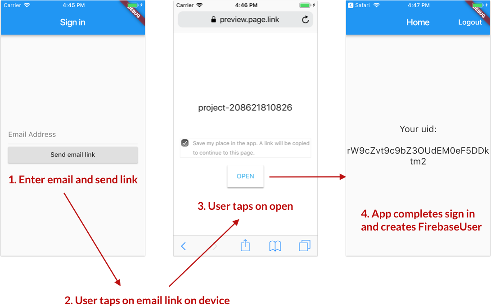

# Firebase passwordless sign-in - example app 

This sample app shows how to implement passwordless email sign in via an email link with Firebase.


## Preview



## Setup steps

The Firebase app needs to be configured correcly. I've been following these steps:

- [Authenticate with Firebase Using Email Link in iOS](https://firebase.google.com/docs/auth/ios/email-link-auth)
- [Authenticate with Firebase Using Email Link in Android](https://firebase.google.com/docs/auth/android/email-link-auth)
- [Passing State in Email Actions](https://firebase.google.com/docs/auth/ios/passing-state-in-email-actions#configuring_firebase_dynamic_links)

## Important note

Support for passwordless email sign in [has been requested](https://github.com/flutter/flutter/issues/22958) but has **not yet been implemented** in the Flutter Firebase repo. Details here:

### [#22958 - Missing Email-Link Sign-In in firebase_auth plugin](https://github.com/flutter/flutter/issues/22958)

Since I needed it for one of my projects, I forked the Firebase plugins repo and started implementing it myself on this branch:

- [bizz84/plugins](https://github.com/bizz84/plugins/tree/enable-passwordless-sign-in)

As part of this, I have implemented the following methods:

- `sendLinkToEmail`
- `isSignInWithEmailLink`
- `signInWithEmailAndLink`

I have implemented the corresponding code for iOS (Android planned).

Unfortunately, the plugin code itself is not enough to complete the entire flow. 

To get things working, I have to handle the incoming links in the `AppDelegate`:

```swift
@UIApplicationMain
@objc class AppDelegate: FlutterAppDelegate {
  
  var eventChannel: FlutterEventChannel {
    guard let controller = window.rootViewController as? FlutterViewController else {
      fatalError("Invalid root view controller")
    }
    return FlutterEventChannel(name: "linkHandler", binaryMessenger: controller)
  }
  let linkStreamHandler = LinkStreamHandler()
  
  override func application(
    _ application: UIApplication,
    didFinishLaunchingWithOptions launchOptions: [UIApplicationLaunchOptionsKey: Any]?
  ) -> Bool {
    GeneratedPluginRegistrant.register(with: self)
    eventChannel.setStreamHandler(linkStreamHandler)
    return super.application(application, didFinishLaunchingWithOptions: launchOptions)
  }
  
  
  override func application(_ application: UIApplication, continue userActivity: NSUserActivity,
                   restorationHandler: @escaping ([Any]?) -> Void) -> Bool {
    
    // Todo: Use platform channel for handling this
    return userActivity.webpageURL.flatMap(handlePasswordlessSignIn)!
  }
  
  @available(iOS 9.0, *)
  override func application(_ app: UIApplication, open url: URL, options: [UIApplicationOpenURLOptionsKey : Any]) -> Bool {
    return application(app, open: url,
                       sourceApplication: options[UIApplicationOpenURLOptionsKey.sourceApplication] as? String,
                       annotation: "")
  }

  
  override func application(_ application: UIApplication, open url: URL, sourceApplication: String?, annotation: Any) -> Bool {
    return handlePasswordlessSignIn(withURL: url)
  }

  func handlePasswordlessSignIn(withURL url: URL) -> Bool {
    linkStreamHandler.handleLink(url.absoluteString)
    return true
  }
}

class LinkStreamHandler: NSObject, FlutterStreamHandler {
  
  var eventSink: FlutterEventSink?
  
  func onListen(withArguments arguments: Any?, eventSink events: @escaping FlutterEventSink) -> FlutterError? {
    self.eventSink = events
    return nil
  }
  
  func onCancel(withArguments arguments: Any?) -> FlutterError? {
    self.eventSink = nil
    return nil
  }
  
  func handleLink(_ link: String) {
    eventSink?(link)
  }
}
```

This code uses `FlutterEventChannel` and `FlutterEventSink`, and is based on this article on Medium:

- [Flutter Platform Channels](https://medium.com/flutter-io/flutter-platform-channels-ce7f540a104e?linkId=56128409)

This works, but means that some native code is needed on the client app to receive the incoming email link, and pass it back to Flutter.

It would be a lot nicer if all this could be included as part of the `FirebaseAuth` plugin itself, however I'm not sure about the best way of achieving this.

For this reason, I have not yet opened a PR to merge this back to [`flutter/plugins`](https://github.com/flutter/plugins).

## Next steps

- [ ] Figure out how to handle the email link properly, so that no custom code is needed in the client app
- [ ] Implement the Android plugin code
- [ ] Handle errors, and make this production ready.
- [ ] Merge this back into `firebase_auth`.

Some help from the Flutter / Firebase team would be greatly appreciated to get this resolved. 🙏

## [LICENSE: MIT](LICENSE.md)
